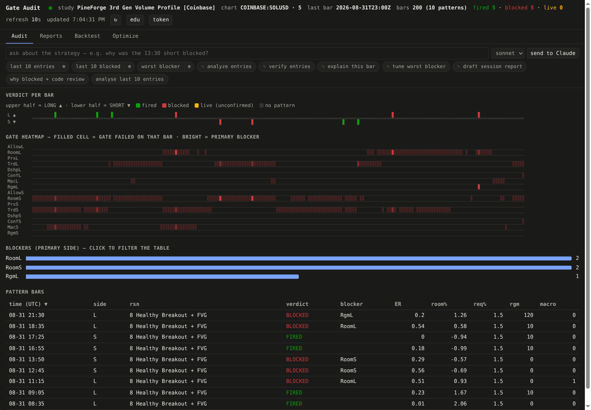
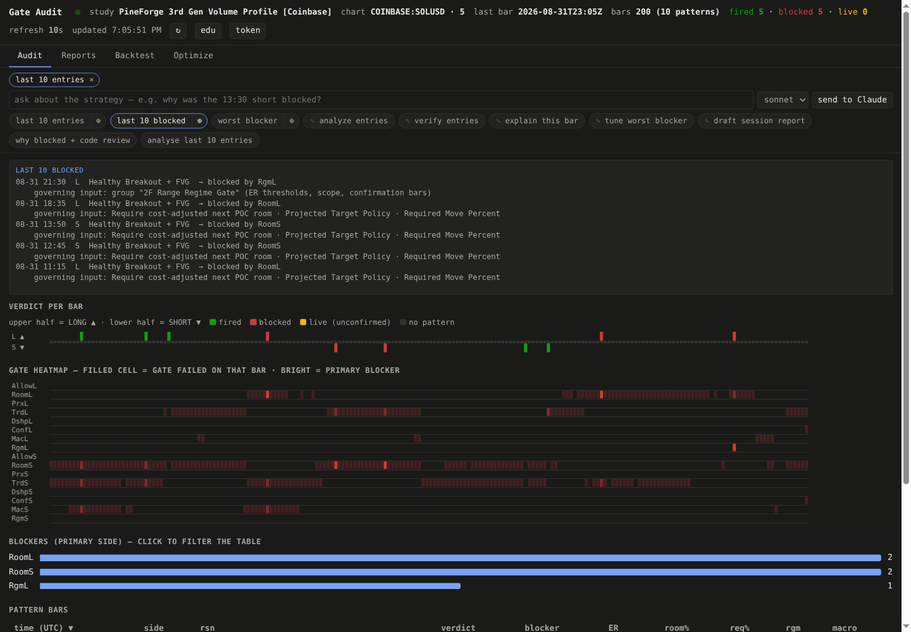
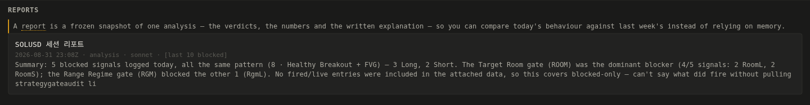
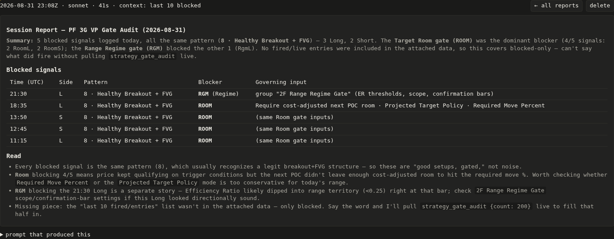
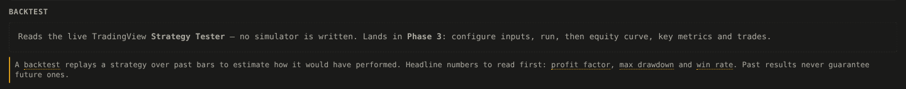

# Gate Audit 뷰어 사용 설명서

> **최종 수정일: 2026-08-31**
> 대상: `scripts/viewer/gate-audit.html` (HTTP 브리지가 `/viewer`로 서빙)
> 기능을 추가·변경하면 이 날짜와 맨 아래 [변경 이력](#10-변경-이력)을 함께 갱신하세요.

터미널에서 `/strategy-gate-debug ...`를 직접 타이핑하지 않고, **브라우저에서 클릭만으로** 전략을 분석하고 그 결과를 리포트로 저장하는 것이 목표입니다.

> 📸 스크린샷은 실제 동작 화면입니다 (COINBASE:SOLUSD · 5분봉, 컨테이너에 설치한 Google Chrome 152에서 캡처).
> UI를 바꾼 뒤에는 `docs/images/`의 이미지도 다시 캡처해 주세요.

---

## 1. 시작하기

```bash
cd ~/gitprojects/tradingview-mcp-jackson
./run.sh
```

`run.sh`가 TradingView Desktop을 CDP로 띄우고, 브리지를 실행하고, 브라우저까지 엽니다. 실행 직후 출력되는 두 줄이 전부입니다:

```
Server is running: http://100.115.92.26:3001/viewer
Bridge token:      mysecret   (paste this into the viewer's token box)
```

- **주소**: 컨테이너 IP가 자동 계산되어 출력됩니다. ChromeOS에서 `127.0.0.1`이나 `penguin.linux.test`는 동작하지 않습니다 → [GATE_AUDIT_GUIDE.md](./GATE_AUDIT_GUIDE.md) 참조
- **토큰**: 첫 접속 시 상단 입력바에 붙여넣으면 `localStorage`에 저장되어 다음부터 자동 로그인

---

## 2. 화면 구성

```
┌──────────────────────────────────────────────────────────────────────────────┐
│ Gate Audit ● study PF 3G VP  chart SOLUSD·5  fired 7 blocked 13 live 0       │  ← 헤더
│                                              [↻] [edu] [token]               │
├──────────────────────────────────────────────────────────────────────────────┤
│  Audit  │  Reports  │  Backtest  │  Optimize                                 │  ← 탭
├──────────────────────────────────────────────────────────────────────────────┤
│ [last 10 entries ×]  [last 10 blocked ×]              ← 첨부된 컨텍스트 칩    │
│ ┌───────────────────────────────────┐ ┌────────┐ ┌───────────────┐          │
│ │ 프롬프트 입력...                   │ │ sonnet▾│ │send to Claude │          │  ← 스마트 프롬프트
│ └───────────────────────────────────┘ └────────┘ └───────────────┘          │
│ [last 10 entries|⊕] [last 10 blocked|⊕] [worst blocker|⊕]                   │  ← 데이터 pill
│ [✎ analyze entries] [✎ verify entries] [✎ explain this bar] …               │  ← 자동입력 pill
│ [why blocked + code review] [analyse last 10 entries]                        │  ← 에이전트 pill
├──────────────────────────────────────────────────────────────────────────────┤
│ CLAUDE · SONNET                                                              │
│ running… 1:23                                                                │  ← 콘솔(채팅)
├──────────────────────────────────────────────────────────────────────────────┤
│ Verdict per bar  /  Gate heatmap  /  Blockers  /  Pattern bars               │  ← 탭 내용
└──────────────────────────────────────────────────────────────────────────────┘
```


*Audit 탭 — 헤더(스터디·심볼·fired/blocked 카운트), 탭, 스마트 프롬프트(모델 드롭다운 + send to Claude), pill 3종, 그리고 판정 스트립·게이트 히트맵·차단자 히스토그램·패턴 봉 표.*

### 탭 4개

| 탭 | 상태 | 내용 |
|---|---|---|
| **Audit** | ✅ 동작 | 봉별 판정 스트립 · 게이트 히트맵 · 차단자 히스토그램 · 패턴 봉 표 · 봉 상세 드로어 |
| **Reports** | ✅ 동작 | 저장된 AI 분석 리포트 목록 / 상세 |
| **Backtest** | ⏳ 예정 | Phase 3 |
| **Optimize** | ⏳ 예정 | Phase 4 |

주소창으로 바로 이동할 수 있습니다: `#audit` · `#reports` · `#reports/<리포트id>`

---

## 3. 스마트 프롬프트 — 3종류의 pill

### 3-1. 데이터 pill (⊕ 붙어 있는 것)

`last 10 entries` · `last 10 blocked` · `worst blocker`

캡슐이 **두 부분**으로 나뉩니다.

```
┌──────────────────────┬────┐
│  last 10 entries     │ ⊕ │
└──────────────────────┴────┘
     ↑ 이름 클릭            ↑ ⊕ 클릭
     결과 패널 토글         프롬프트에 데이터 첨부
```

- **이름 클릭** → 콘솔에 결과가 뜹니다. **한 번 더 누르면 사라집니다** (토글). 열려 있는 동안 pill 테두리가 파랗게 표시됩니다.
- **⊕ 클릭** → **그 순간의 데이터를 캡처**해서 입력창 위에 `[last 10 entries ×]` 칩으로 붙입니다. `×`로 제거합니다.


*`last 10 blocked`의 이름을 눌러 패널을 연 상태(테두리가 파랗게 강조됨) + `last 10 entries`의 ⊕를 눌러 입력창 위에 `[last 10 entries ×]` 칩이 붙은 상태.*

> 💡 ⊕는 "가서 가져와라"가 아니라 **데이터 자체를 첨부**합니다. 즉 **화면에서 본 그 데이터**가 그대로 AI에게 전달됩니다.

| pill | 내용 | MCP 도구 |
|---|---|---|
| `last 10 entries` | Strategy Tester의 최근 10개 거래 | `data_get_trades` |
| `last 10 blocked` | 최근 차단된 진입 10개 + 차단 게이트 + 지배 입력 | 이미 폴링된 데이터 재사용 (요청 0회) |
| `worst blocker` | 차단자 히스토그램 (누르면 표도 그 게이트로 필터 + Audit 탭으로 이동) | 이미 폴링된 데이터 |

### 3-2. 자동입력 pill (✎ 표시)

누르면 **입력창에 문장을 대신 적어줍니다.** 바로 실행되지 않으므로 수정 후 보내면 됩니다.

| pill | 하는 일 | 모델 |
|---|---|---|
| `✎ analyze entries` | 첨부한 진입들 중 뭐가 돈이 되고 뭐가 새는지 분석 | sonnet |
| `✎ verify entries` | 통과한 게이트가 Pine 소스 기준으로 정말 맞는지 검증 | **opus** |
| `✎ explain this bar` | **선택한 봉**의 진입/차단 이유 (봉을 먼저 클릭해야 함) | sonnet |
| `✎ tune worst blocker` | 최다 차단 게이트와 그 지배 입력을 넣어 완화안 요청 | sonnet |
| `✎ draft session report` | 첨부 데이터로 세션 리포트 작성 | sonnet |

### 3-3. 에이전트 pill (원클릭 실행)

`why blocked + code review` · `analyse last 10 entries`

데이터 첨부 → 프롬프트 작성 → 전송까지 **한 번에** 실행합니다.

- `why blocked + code review` → 차단 목록 자동 첨부 + **opus**로 Pine 소스까지 읽어 코드리뷰
- `analyse last 10 entries` → 거래 목록 자동 첨부 + **sonnet**으로 분석

---

## 4. 모델 선택 (sonnet / opus)

입력창 옆 드롭다운에서 고릅니다. 선택은 `localStorage`에 저장됩니다.

| 모델 | 언제 | 비용 |
|---|---|---|
| **sonnet** (기본값) | 데이터 읽고 요약·서술 | 낮음 |
| **opus** | 추론, 코드리뷰, 원인 분석 | 높음 |

- 자동입력 pill을 누르면 **그 pill에 맞는 모델로 드롭다운이 자동 전환**됩니다 (`✎ verify entries` → opus).
- 에이전트 pill은 자기 모델을 강제로 사용합니다.
- 브리지 기본값은 `MCP_BRIDGE_AGENT_MODEL` 환경변수로 바꿉니다 (허용: `sonnet` `opus` `haiku`).

> ⚠️ **왜 중요한가:** 이 값을 넘기지 않으면 CLI 기본 모델(예: `opus[1m]`)이 사용됩니다. 단순히 데이터를 읽고 요약하는 작업에 최고가 모델을 쓰게 되고, 터미널에서 `/model`을 바꾸면 뷰어 비용까지 같이 바뀝니다. 그래서 **항상 명시적으로 지정**합니다.

---

## 5. Claude에 보내기

### 흐름

```
데이터 준비            프롬프트 작성           실행                  결과
─────────────────────────────────────────────────────────────────────────────
⊕ 로 칩 첨부     →   ✎ 로 자동입력 or 직접 타이핑   →   [send to Claude]  →  running… 1:23
                                                                              ↓
                                          채팅에 요약 + [open report ↗] ← 완료
```

### 실제로 전송되는 내용

```
/strategy-gate-debug <입력한 프롬프트>

### context: last 10 blocked
08-31 18:35  L  Healthy Breakout + FVG  → blocked by RoomL
    governing input: Require cost-adjusted next POC room · ...
```

### 실행 중 동작

- 채팅에 `running… 0:37` 이 1초마다 갱신됩니다
- **전송 버튼과 에이전트 pill이 비활성화**됩니다 (동시 실행 차단). 서버도 409로 거부합니다.
- **실행 도중 새로고침해도 됩니다** — 상태를 다시 물어서 `running…` 이 이어지고 결과도 정상 수신됩니다
- 5분이 넘으면 자동 종료됩니다

### 완료 후

채팅 줄이 **리포트 요약문**으로 바뀌고 옆에 **`open report ↗`** 링크가 생깁니다. 새 창에서 전체 리포트가 열립니다.

---

## 6. Reports 탭

- **목록**: 카드마다 날짜 · 제목 · 사용 모델 · 첨부했던 컨텍스트 · 요약
- **상세**: 카드를 클릭 (또는 `open report ↗`) → 마크다운으로 렌더링된 본문, 소요 시간, `prompt that produced this` (접힘), `delete`

*카드에 날짜 · 종류 · **사용 모델** · 첨부했던 컨텍스트 · 요약이 표시됩니다.*


*상세 화면 — 마크다운(제목·표·굵게·인라인 코드·목록)이 렌더링되고, 상단에 모델과 소요 시간, 하단에 `prompt that produced this`(접힘)와 `delete`가 있습니다.*

- 저장 위치: 저장소의 `reports/*.json` (**git에는 커밋되지 않음** — `.gitignore` 처리)

---

## 7. Edu 모드

헤더의 **`edu`** 버튼으로 켜고 끕니다 (설정은 저장됨).

- 용어에 **점선 밑줄**이 생기고, 마우스를 올리면 초보자용 설명이 뜹니다
- 각 탭에 초보자용 해설 문단이 추가로 표시됩니다

*Edu 모드 ON — 용어에 점선 밑줄(`backtest`, `profit factor`, `max drawdown`, `win rate`)이 생기고, 각 탭에 노란 테두리의 초보자용 해설이 나타납니다.*

- 현재 등록된 용어: profit factor · max drawdown · win rate · backtest · sweep · overfitting · blocker · report

---

## 8. 보안 주의사항

`send to Claude`는 **당신의 PC에서 `claude -p`를 실제로 실행**합니다. 그래서 다음 장치가 걸려 있습니다:

| 장치 | 내용 |
|---|---|
| 옵트인 | `MCP_BRIDGE_ALLOW_AGENT=1` 없으면 엔드포인트가 404 (`run.sh`는 로컬용으로 기본 활성화) |
| 토큰 | 브리지 토큰 필수 |
| 도구 제한 | `--allowedTools mcp__tradingview Read Grep Glob` — 그 외 도구 없음 |
| 금지 | `--dangerously-skip-permissions` 사용 안 함 |
| 모델 | 허용 목록(`sonnet`/`opus`/`haiku`) 외의 값은 무시하고 기본값으로 폴백 (플래그 주입 방지) |
| 동시성 | 한 번에 한 건, 5분 타임아웃 |
| 환경 | 자식 프로세스에서 `MCP_BRIDGE_*` 제거 (브리지 토큰 노출 차단) |

> 🔴 **터널(ngrok/cloudflared) 뒤에서는 절대 활성화하지 마세요.** URL을 아는 사람이 당신의 PC에서 명령을 실행할 수 있게 됩니다.

---

## 9. 문제 해결

| 증상 | 원인 / 조치 |
|---|---|
| 페이지가 안 열림 | ChromeOS에서는 `127.0.0.1` 불가. `run.sh`가 출력한 IP 주소를 쓸 것 |
| `send to Claude` 대신 `run`으로 표시됨 | 에이전트 비활성. `MCP_BRIDGE_ALLOW_AGENT=1`로 브리지 재시작 (이 경우 프롬프트는 클립보드로 복사됨) |
| 401 / 토큰 입력바가 계속 뜸 | 토큰 불일치. `run.sh` 출력값 확인 |
| `a run is already in progress` | 이전 실행이 진행 중. 완료를 기다리거나 5분 타임아웃 대기 |
| `run state lost (bridge restarted?)` | 실행 도중 브리지가 재시작됨. 리포트는 생성되지 않음. 다시 실행 |
| 데이터가 이상하게 잘림 | headroom 플러그인 의심 → `claude plugin disable headroom` |
| `last 10 entries`가 비어 있음 | 차트에 **전략**(인디케이터 아님)이 올라가 있고 Strategy Tester에 결과가 있어야 함 |

---

## 10. 변경 이력

| 날짜 | 변경 내용 |
|---|---|
| 2026-08-31 | 실제 동작 스크린샷 5장 추가 (`docs/images/`). 컨테이너에 Google Chrome 152 설치 후 Playwright로 캡처. |
| 2026-08-31 | 최초 작성. Phase 1(탭·스마트 프롬프트·Edu 모드), Phase 1.5(pill 토글·컨텍스트 칩·자동입력 pill), Phase 2(send to Claude·리포트 저장/열람·모델 선택) 사용법 수록. |
